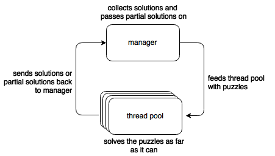

# Synchodoku

This is a (pretty crazy) experiment to write
a sudoku solver in C that uses message-passing
concurrency instead of doing a naïve recursive approach
or using traditional state-sharing concurrency.

## How does it work?

The idea is that there is a thread pool and a
manager, with the thread pool doing the actual
solving and the manager passing on tasks to
the solver threads and receiving data from
them.

## Libraries

 -  [ZeroMQ](http://zeromq.org)
 -  [mpack](https://github.com/ludocode/mpack)
 -  [jansson](http://www.digip.org/jansson/)
 -  [glib](https://developer.gnome.org/glib/2.48/)
 -  `pthreads`
